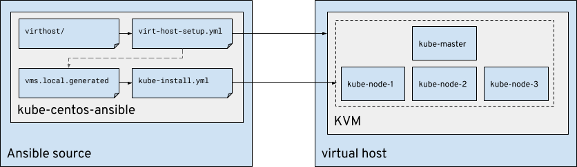

# Kucean

**Kucean** (p. koo-see-ehn) is a set of Ansible playbooks and roles that allows
you to instantiate a vanilla Kubernetes cluster on CentOS virtual machines or
baremetal.

Additionally, kucean includes CNI pod networking (defaulting to Flannel, with
an ability to deploy Weave and Multus).

`kube-centos-ansible` is the project name, which can be compactly referred to
as _kucean_ i.e. (_ku_)bernetes-(_ce_)ntos-(_an_)sible

## Playbooks

| Playbook                         | Inventory                             | Purpose                                                            |
| -------------------------------- | ------------------------------------- | ------------------------------------------------------------------ |
| `virt-host-setup.yml`            | `./inventory/virthost/`               | Provision a virtual machine host                                   |
| `kube-install.yml`               | `./inventory/vms.local.generated`     | Install and configure a k8s cluster                                |
| `kube-teardown.yml`              | `./inventory/vms.local.generated`     | Runs `kubeadm reset` on all nodes to tear down k8s                 |
| `vm-teardown.yml`                | `./inventory/virthost/`               | Destroys VMs on the virtual machine host                           |
| `multus-cni.yml`                 | `./inventory/vms.local.generated`     | Compiles [multus-cni](https://github.com/Intel-Corp/multus-cni)    |
| `gluster-install.yml`            | `./inventory/vms.local.generated`     | Install a GlusterFS cluster across VMs (requires vm-attach-disk)   |
| `fedora-python-bootstrapper.yml` | `./inventory/vms.local.generated`     | Bootstrapping Python dependencies on cloud images                  |

*(Table generated with [markdown tables](http://www.tablesgenerator.com/markdown_tables))*

## Overview

Kucean provides the means to install and setup KVM as a virtual host platform
on which virtual machines can be created, and used as the foundation of a
Kubernetes cluster installation.



There are generally two steps to this deployment:

* Installation of KVM on the baremetal system and virtual machine instantiation
* Kubernetes environment installed and setup on the virtual machines

First we start by configuring our `virthost/` inventory to match our working
environment, including DNS or IP address of the baremetal system that we'll
install KVM onto. We also setup our network (KVM network, whether that be a
bridged interface, or a NAT interface), and then define the system topology
we're going to deploy (number of virtual machines to instantiate).

We do this with the `virthost-setup.yml` playbook, which performs the virtual
host basic configuration, virtual machine instantiation, and extra virtual disk
creation when configuring persistent storage with GlusterFS.

During the `virthost-setup.yml` a `vms.local.generated` inventory file is
created with the IP addresses and hostname of the virtual machines. The
`vms.local.generated` file can then be used with `kube-install.yml`.

## Usage

### Step 1. Create virtual host inventory

Copy the example `virthost` inventory into a new directory.

```
cp -r inventory/examples/virthost inventory/virthost/
```

### Step 2. Setup virtual host inventory

Modify `./inventory/virthost/virthost.inventory` to setup a virtual
host (skip to step 3 if you already have an inventory).

Want more VMs? Edit `inventory/virthost/group_vars/virthost.yml` and add
an override list via `virtual_machines` (template in `group_vars/all.yml`).

> **WARNING**
>
> If you're not going to be connecting to the virtual machines from the same
> network as your source machine, you'll need to make sure you setup the
> `ssh_proxy_enabled: true` and other related `ssh_proxy_...` variables to
> allow the `kube-install.yml` playbook to work properly. See next **NOTE** for
> more information.

**Running on virthost directly**
```
ansible-playbook -i inventory/virthost/ virthost-setup.yml
```

**Setting up virthost as a jump host**
```
ansible-playbook -i inventory/virthost/ -e ssh_proxy_enabled=true virthost-setup.yml
```

> **NOTE**
>
> There are a few extra variables you may wish to set against the virtual host
> which can be satisfied in the `inventory/virthost/group_vars/virthost.yml`
> file of your local inventory configuration in `inventory/virthost/` that you
> just created.
>
> Primarily, this is for overriding the default variables located in the
> `group_vars/all.yml` file, or overriding the default values associated with
> the roles.
>
> Some common variables you may wish to override include:
>
> * `bridge_networking: false`  _disable bridge networking setup_
> * `images_directory: /home/images/kubelab`  _override image directory
>   location_
> * `spare_disk_location: /home/images/kubelab`  _override spare disk location_
>
> The following values are used in the generation of the dynamic inventory file
> `vms.local.generated`
>
> * `ssh_proxy_enabled: true`  _proxy via jump host (remote virthost)_
> * `ssh_proxy_user: root`  _username to SSH into virthost_
> * `ssh_proxy_host: virthost`  _hostname or IP of virthost_
> * `ssh_proxy_port: 2222` _port of the virthost (optional, default 22)_
> * `vm_ssh_key_path: /home/lmadsen/.ssh/id_vm_rsa`  _path to local SSH key_


### Step 3. Install Kubernetes

During the execution of _Step 1_ a local inventory should have been
generated for you called `inventory/vms.local.generated` that contains the
hosts and their IP addresses. You should be able to pass this inventory to the
`kube-install.yml` playbook.

> **NOTE**
>
> If you're not running the Ansible playbooks from the virtual host itself,
> it's possible to connect to the virtual machines via SSH proxy. You can do
> this by setting up the `ssh_proxy_...` variables as noted in _Step 2_.

Alternatively you can ignore the generated inventory and copy the example
inventory directory from `inventory/examples/vms/` and modify to your hearts
content.

```
ansible-playbook -i inventory/vms.local.generated kube-install.yml
```

Once you've done that, you should be able to connect to your Kubernetes master
virtual machine and run `kubectl get nodes` and see that all your nodes are in
a _Ready_ state. (It may take some time for everything to coalesce and the
nodes to report back to the Kubernetes master node.)

In order to login to the nodes, you may need to `ssh-add
~/.ssh/vmhost/id_vm_rsa`. The private key created on the virtual host will be
automatically fetched to your local machine, allowing you to connect to the
nodes when proxying.

> **Pro Tip**
>
> You can create a `~/.bashrc` alias to SSH into the virtual machines if you're
> not executing the Ansible playbooks directly from your virtual host (i.e.
> from your laptop or desktop). To SSH into the nodes via SSH proxy, add the
> following alias:
>
> ```
> alias ssh-virthost='ssh -o ProxyCommand="ssh -W %h:%p root@virthost"'
> ```
> It's assumed you're logging into the virtual host as the `root` user and at
> hostname `virthost`. Change as required.
>
> **Usage**: `source ~/.bashrc ; ssh-virthost centos@kube-master`

### Step 4. Checking your installation

Once you're logged into your Kubernetes master node, run the following command
to check the state of your cluster.

```
kubectl 
```

# Additional Scenarios and Usage

In addition to setting up a basic vanilla Kubernetes environment, Kucean
supports some additional overrides and technology changes, including deployment
of a specific version or binary of Kubernetes, or using CRI-O as a backend.

## Setting a specific version

You may optionally set the `kube_version` variable to install a specific
version. This version number comes from a `yum search kubelet
--showduplicates`. For example:

```
ansible-playbook -i inventory/vms.local.generated \
    -e 'kube_version=1.6.7-0' \
    kube-install.yml
```

## Install specific binaries

By default, we install the kubelet (and `kubeadm`, `kubectl` and the core CNI
plugins) via RPM. However, if you'd like to install specific binaries for
either the kubelet, kubeadm or kubetl -- you can do so by specifying that you'd
like to perform a binary install and specify URLs (that point to, say, binaries
in a GitHub release).

There are sample variables provided in the `./group_vars/all.yml` file, and you
can set them up such as:

```
binary_install: true
binary_kubectl_url: https://github.com/leblancd/kubernetes/releases/download/v1.9.0-alpha.1.ipv6.1b/kubectl
binary_kubeadm_url: https://github.com/leblancd/kubernetes/releases/download/v1.9.0-alpha.1.ipv6.1b/kubeadm
binary_kubelet_url: https://github.com/leblancd/kubernetes/releases/download/v1.9.0-alpha.1.ipv6.1b/kubelet
binary_install_force_redownload: false
```

## Using CRI-O

You can also enable [CRI-O](http://cri-o.io/) to have an OCI compatible
runtime. Set the `container_runtime` variable in
`inventory/vms.local.generated` under `[master:vars]` and `[nodes:vars]`, or as
an extra var when you run the playbook:

```
$ ansible-playbook -i inventory/vms.local.generated \
    -e 'container_runtime=crio' \
    kube-install.yml
```

Additionally, the compilation of CRI-O requires a beefier machine, memory-wise.
It's recommended you spin up the machines with 4 gigs of ram or greater during
the VM creation phase, should you use it. One may wish to add the parameters
`-e "vm_parameters_ram_mb=4096"` to your playbook run of `virt-host-setup.yml`.

## Using Fedora

Use of Fedora is currently suggested should you require the use of Buildah.
Buildah requires functionality in later Linux kernels that are unavailable in
recent versions of CentOS.

Take a gander at the `./inventory/examples/crio/crio.inventory` for an example
of how to override the proper variables to use Fedora.

# About

Initially inspired by:

* [k8s 1.5 on Centos](http://linoxide.com/containers/setup-kubernetes-kubeadm-centos/)
* [kubeadm getting started](https://kubernetes.io/docs/getting-started-guides/kubeadm/)
